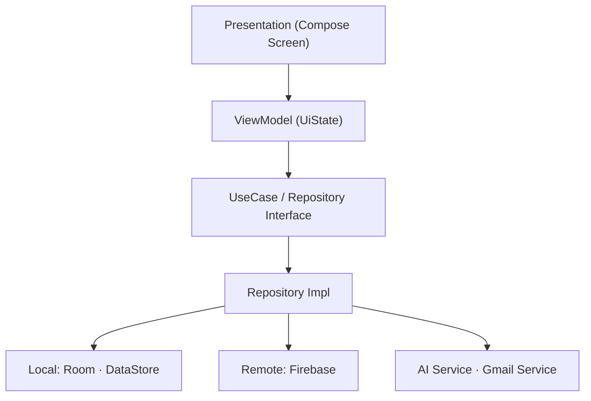
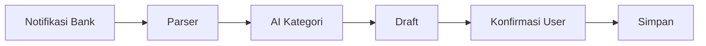

<div align="center">

# 💰 SmartFinance

**Aplikasi manajemen keuangan pribadi berbasis Kotlin + Jetpack Compose dengan deteksi transaksi otomatis berbantuan AI.**

[](https://developer.android.com)
[](https://kotlinlang.org)
[](https://developer.android.com/jetpack/compose)
[](https://developer.android.com)

</div>

> [!NOTE]
> SmartFinance adalah **personal finance**, **bukan** mobile banking. Aplikasi **tidak** melakukan transfer, pembayaran, top up, maupun menyimpan PIN/OTP/CVV/Nomor Kartu.

---

## 📑 Daftar Isi

- [Fitur](#-fitur)
- [Arsitektur](#-arsitektur)
- [Tech Stack](#-tech-stack)
- [Setup](#-setup)
- [Deteksi Transaksi Otomatis](#-deteksi-transaksi-otomatis)
- [Keamanan](#-keamanan)
- [Build Rilis & Distribusi](#-build-rilis--distribusi)
- [Struktur Proyek](#-struktur-proyek)
- [Lisensi](#-lisensi)

---

## ✨ Fitur

| Fitur | Deskripsi |
|-------|-----------|
| 🔐 **Autentikasi** | Google Sign-In & Email/Password (Firebase Auth). Auto-login selama token valid; logout menghapus session. |
| 📊 **Dashboard** | Saldo total, income vs expense bulan ini, quick action, ringkasan budget, chart analytics, transaksi terbaru. |
| 💸 **Transaksi** | Create, update, delete, search, filter, sort — untuk *Income* & *Expense*. |
| 🤖 **Deteksi Otomatis (AI)** | Membaca notifikasi bank & email Gmail (readonly), memprediksi merchant, nominal, kategori & tipe. Selalu dibuat sebagai **draft** untuk dikonfirmasi user. |
| 🎯 **Budget** | Anggaran per kategori dengan progress otomatis & peringatan bila melebihi. |
| 📈 **Analytics** | Income vs expense, breakdown kategori, tren bulanan & mingguan, ringkasan. |
| 🌙 **Tema** | Dark Mode penuh dengan Material 3 (System / Light / Dark). |
| 📴 **Offline First** | Semua data tersimpan lokal (Room). Internet hanya untuk login, AI, Gmail. |

<details>
<summary><b>Kategori bawaan (default)</b></summary>

**Income:** Salary · Bonus · Investment · Gift · Other
**Expense:** Food · Transport · Shopping · Entertainment · Health · Education · Bills · Travel · Subscription · Others

> Kategori custom bisa ditambah/edit/hapus. Kategori bawaan tidak bisa dihapus.
</details>

<details>
<summary><b>Aturan transaksi</b></summary>

- **Amount** wajib &gt; 0
- **Category** wajib dipilih
- **Date** wajib
- **Name** wajib · **Note** opsional
</details>

---

## 🏗️ Arsitektur

Clean Architecture + MVVM + Repository Pattern.



**Prinsip:**
- View **tidak** mengakses Repository langsung.
- Repository **tidak** mengetahui UI.
- ViewModel hanya mengelola state (`Loading` / `Success` / `Empty` / `Error`).

---

## 🧰 Tech Stack

| Kategori | Teknologi |
|----------|-----------|
| Bahasa | Kotlin |
| UI | Jetpack Compose · Material 3 |
| DI | Hilt |
| Database | Room (dienkripsi via **SQLCipher**) |
| Preferences | DataStore |
| Cloud | Firebase Authentication · Firestore |
| AI | OpenAI-compatible / Gemini (auto-detect) |
| Background | WorkManager |
| Navigasi | Navigation Compose |

**Requirement:** Android Studio (terbaru) · **minSdk 26** · **targetSdk/compileSdk 35** · **JDK 11**

---

## 🚀 Setup

### 1. Clone

```bash
git clone https://github.com/yusuffadllh/CPRecap.git
cd CPRecap
```

### 2. Konfigurasi Firebase (`google-services.json`) — WAJIB

> [!IMPORTANT]
> File `app/google-services.json` **tidak** disertakan di repo (berisi konfigurasi Firebase & sengaja di-ignore). Anda **harus** menyediakannya sendiri, atau build akan gagal.

1. Buka [Firebase Console](https://console.firebase.google.com/) → buat/pilih project.
2. Tambahkan aplikasi Android dengan package name: `com.yusuffdllh.smartfinance`
3. Aktifkan **Authentication** → provider **Google** dan **Email/Password**.
4. Tambahkan **SHA-1** keystore (debug & release) di pengaturan project Firebase — wajib untuk Google Sign-In.
5. Unduh `google-services.json` → letakkan di `app/google-services.json`.

### 3. Konfigurasi AI (di dalam aplikasi)

> [!NOTE]
> Kredensial AI **tidak** disimpan di kode. Dikonfigurasi saat runtime lewat aplikasi dan disimpan **terenkripsi** di DataStore perangkat.

Di aplikasi: **Profil → Notifikasi → Pengaturan AI**, isi:

| Field | Contoh |
|-------|--------|
| **Base URL** | `https://.../v1` (OpenAI-compatible) atau `https://generativelanguage.googleapis.com/v1beta` (Gemini) |
| **API Key** | Kunci API Anda |
| **Model** | `gpt-4o-mini`, `gemini-1.5-flash`, dll |

Layanan AI otomatis mendeteksi dialek:
- Key berawalan `sk-` **atau** Base URL diakhiri `/v1` → **format OpenAI** (`/chat/completions`, `Authorization: Bearer`).
- Selain itu → **format Gemini** (`:generateContent`, `?key=`).

### 4. Build & Run

```bash
./gradlew assembleDebug      # build debug
./gradlew testDebugUnitTest  # unit test
```

Atau jalankan langsung dari Android Studio.

---

## 🔍 Deteksi Transaksi Otomatis

### 📲 Notification Reader

Menggunakan `NotificationListenerService` untuk membaca **hanya** notifikasi terkait transaksi.



**Aplikasi didukung:** BRImo · Livin' · BCA Mobile · myBCA · BNI Mobile · SeaBank · Jenius · DANA · OVO · GoPay · ShopeePay · LinkAja

**Data diekstrak:** Merchant · Amount · Date · Reference · Transaction Type

> Aktifkan lewat **Profil → Notifikasi → Pembaca Notifikasi Bank**. Hasil parsing **selalu** dibuat sebagai draft — user wajib konfirmasi.

### 📧 Gmail Sync

Menggunakan **Gmail Readonly Scope** untuk mencari bukti transaksi (struk/invoice) di inbox, lalu diproses AI. Berjalan periodik via WorkManager, bisa dipicu manual lewat **"Sinkronkan Sekarang"**.

> [!NOTE]
> Aplikasi hanya meminta scope **readonly** — tidak pernah mengirim/menghapus email, dan tidak membaca email non-transaksi.

### 🧠 Aturan AI

- Confidence **≥ 90%** → kategori dipilih otomatis.
- Confidence **&lt; 90%** → tampilkan pilihan ke user.
- AI **tidak boleh** menghapus transaksi, mengubah nominal, atau mengubah tanggal tanpa konfirmasi user.

---

## 🔒 Keamanan

SmartFinance menerapkan pertahanan berlapis:

| Lapisan | Implementasi |
|---------|--------------|
| **Obfuscation** | R8 aktif di release (minify + resource shrinking) menyulitkan reverse-engineering. |
| **Enkripsi API Key** | API key AI dienkripsi dengan **AES-256/GCM**, kunci disimpan di **Android Keystore** (hardware-backed). |
| **Enkripsi Database** | Database Room dienkripsi at-rest dengan **SQLCipher** — data tak terbaca meski file DB disalin. |
| **Backup Hardening** | `allowBackup=false` + exclude rules — data tidak bisa ditarik via `adb backup`. |
| **Release Signing** | APK ditandatangani keystore rilis; kredensial keystore di-ignore dari Git. |

> [!IMPORTANT]
> Aplikasi **tidak pernah** menyimpan Password, PIN, OTP, CVV, atau Nomor Kartu.

---

## 📦 Build Rilis & Distribusi

### 1. Siapkan keystore rilis

```bash
keytool -genkeypair -v -keystore release.jks -alias smartfinance -keyalg RSA -keysize 2048 -validity 10000
```

Salin template lalu isi kredensial:

```bash
cp keystore.properties.template keystore.properties
# isi storePassword, keyAlias, keyPassword di keystore.properties
```

> [!CAUTION]
> **Simpan `release.jks` + password baik-baik.** Jika hilang, Anda tidak bisa meng-update aplikasi dengan signature yang sama. File `release.jks` & `keystore.properties` **tidak** boleh di-commit (sudah di-`.gitignore`).

### 2. Build APK rilis

```bash
./gradlew assembleRelease
```

Output: `app/build/outputs/apk/release/app-release.apk`

### 3. Distribusi di luar Google Play (mis. via link)

- APK **harus** ditandatangani keystore rilis (langkah di atas).
- Daftarkan **SHA-1 & SHA-256 keystore rilis** di Firebase Console — jika tidak, Google Sign-In gagal di perangkat lain:
  ```bash
  keytool -list -v -keystore release.jks -alias smartfinance
  ```
- Penerima perlu mengaktifkan **"Install unknown apps"** di perangkat.

---

## 📂 Struktur Proyek

```
app/src/main/java/com/yusuffdllh/smartfinance/
├── components/     # Reusable Compose components
├── presentation/   # Screen + ViewModel
├── domain/         # UseCase + Repository interface
├── data/           # Entity, DAO, Repository impl, DataStore
├── di/             # Hilt modules
├── navigation/     # Navigation Compose
├── service/        # Notification, AI, Gmail service
├── utils/          # Formatter, helper, CryptoManager
└── ui.theme/       # Color, Typography, Theme
```

---

## 📄 Lisensi

Belum ditentukan. Tambahkan file `LICENSE` sesuai kebutuhan.

<div align="center">

---

Dibuat dengan ❤️ menggunakan Kotlin & Jetpack Compose

</div>
